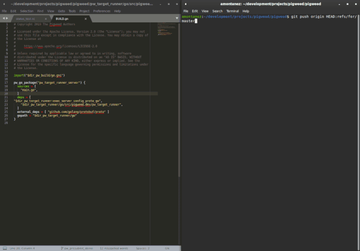

# Pigweed

Pigweed is an open source collection of embedded-targeted libraries--or as we
like to call them, modules. These modules are building blocks and infrastructure
that enable faster and more reliable development on small-footprint MMU-less
32-bit microcontrollers like the STMicroelectronics STM32L452 or the Nordic
nRF52832.

Pigweed is in the early stages of development, and should be considered
experimental. We’re continuing to evolve the platform and add new modules. We
value developer feedback along the way.

Pigweed is an open source project with a [code of conduct](CODE_OF_CONDUCT.md)
that we expect everyone who interacts with the project to respect.

# Getting Started

If you'd like to get set up with Pigweed, please visit the
[setup guide](docs/setup.md), and then check out the
[Pigweed developer's guide](docs/developer_guide.md) for more information on how
to get the most out of Pigweed.

# What does Pigweed offer?

There are many modules in Pigweed, and this section only showcases a small
selection that happen to produce visual output. For more information about the
different Pigweed module offerings, refer to "modules" section in the full
documentation.

## pw_watch

In the web development space, file system watchers are prevalent. These watchers
trigger a web server reload on source change, making development much faster. In
the embedded space, file system watchers are less prevalent; however, they are
no less useful! The Pigweed watcher module makes it easy to instantly compile,
flash, and run tests upon save. Combined with the GN-based build which expresses
the full dependency tree, only the exact tests affected by a file change are run
on saves.

The demo below shows pw_watch building for a STMicroelectronics STM32F429I-DISC1
development board, flashing the board with the affected test, and verifying the
test runs as expected. Once this is set up, you can attach multiple devices to
run tests in a distributed manner to reduce the time it takes to run tests.

## pw_presubmit

Presubmit checks are essential tools, but they take work to set up, and projects
don’t always get around to it. The pw_presubmit module provides tools for
setting up high quality presubmit checks for any project. We use this framework
to run Pigweed’s presubmit on our workstations and in our automated building
tools.

The pw_presubmit module includes pw format, a tool that provides a unified
interface for automatically formatting code in a variety of languages. With pw
format, you can format C, C++, Python, GN, and Go code according to
configurations defined by your project. pw format leverages existing tools like
clang-format, and it’s simple to add support for new languages.

## pw_env_setup

A classic problem in the embedded space is reducing the time from git clone to
having a binary executing on a device. The issue is that an entire suite of
tools is needed for non-trivial production embedded projects. For example:

 - A C++ compiler for your target device, and also for your host
 - A build system or three; for example, GN, Ninja, CMake, Bazel
 - A code formatting program like clang-format
 - A debugger like OpenOCD to flash and debug your embedded device
 - A known Python version with known modules installed for scripting
 - A Go compiler for the Go-based command line tools
 - ... and so on

In the server space, container solutions like Docker or Podman solve this;
however, in our experience container solutions are a mixed bag for embedded
systems development where one frequently needs access to native system resources
like USB devices, or must operate on Windows.

env_setup is our compromise solution for this problem that works on Mac,
Windows, and Linux. It leverages the Chrome packaging system CIPD to bootstrap a
Python installation, which in turn inflates a virtual environment. The tooling
is installed into your workspace, and makes no changes to your system. This
tooling is designed to be reused by any project.

## pw_unit_test

Unit testing is important, and Pigweed offers a portable library that’s broadly
compatible with [Google Test](https://github.com/google/googletest). Unlike
Google Test, pw_unit_test is built on top of embedded friendly primitives; for
example, it does not use dynamic memory allocation. Additionally, it is easy to
port to new target platforms by implementing the
[test event handler interface](https://pigweed.googlesource.com/pigweed/pigweed/+/refs/heads/master/pw_unit_test/public/pw_unit_test/event_handler.h).

## And more!

 - **pw_cpu_exception_armv7m**: Robust low level hardware fault handler for ARM
   Cortex-M; the handler even has unit tests written in assembly to verify
   nested-hardware-fault handling!

 - **pw_polyfill**: Similar to JavaScript “polyfill” libraries, this module
   provides selected C++17 standard library components that are compatible with
   C++11 and C++14.

 - **pw_minimal_cpp_stdlib**: An entirely incomplete implementation of the C++17
   standard library, that provides some of the primitives needed by Pigweed
   itself. Useful for projects that want to use Pigweed, but don’t enable the
   typical standard C++ libraries like GNU’s libstdc++ or LLVM’s libc++. Don’t
   use this module unless you know what you are doing.

 - **pw_kvs**: A key-value-store implementation for flash-backed persistent
   storage with integrated wear levelling. This is a lightweight alternative to
   a file system for embedded devices.

 - **pw_protobuf**: An early preview of our wire-format-oriented protocol buffer
   implementation. This protobuf compiler makes a different set of
   implementation tradeoffs than the most popular protocol buffer library in
   this space, nanopb.
